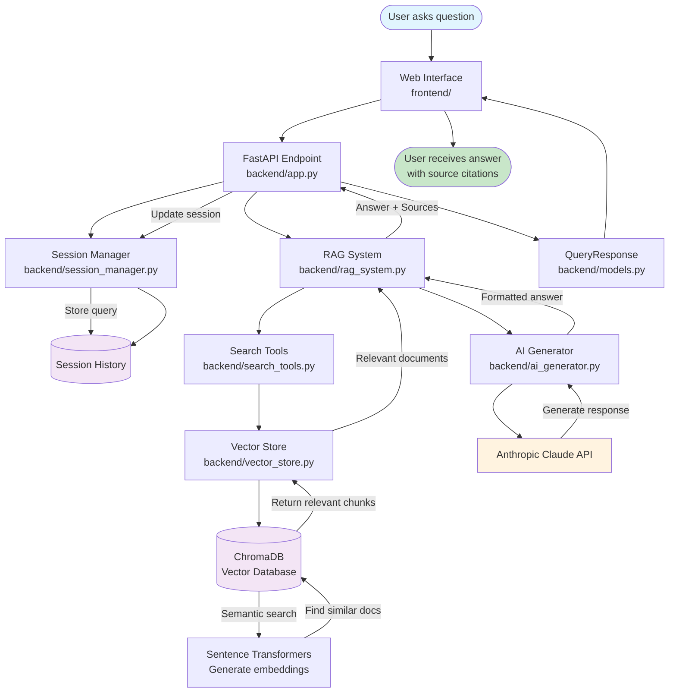

# RAG System Question-to-Response Flow

## Process Flow Description

1. **User Input**: User submits a question through the web interface
2. **API Request**: Frontend sends POST request to `/query` endpoint
3. **Session Management**: System creates/retrieves session for conversation tracking
4. **RAG Processing**: Core RAG system orchestrates the retrieval and generation
5. **Document Retrieval**: 
   - Search tools create embeddings of the query
   - Vector store performs semantic search in ChromaDB
   - Returns most relevant document chunks
6. **AI Generation**:
   - AI Generator formats context with retrieved documents
   - Sends to Claude API with system prompt and context
   - Receives intelligent, context-aware response
7. **Response Delivery**: Answer with source citations returned to user
8. **Session Update**: Conversation history updated for continuity